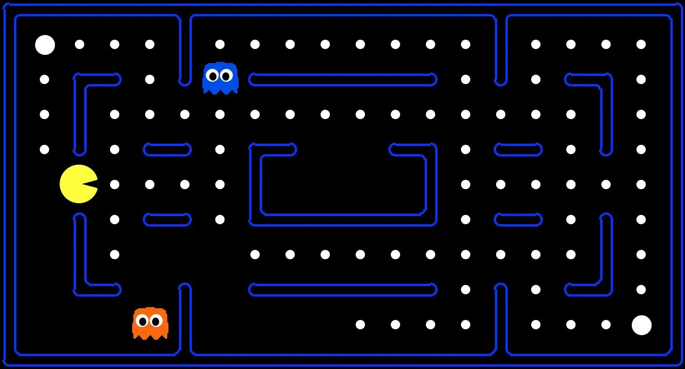

# Berkeley AI course

  

Here there can be found my solutions to [Berkeley's AI '22](https://inst.eecs.berkeley.edu/~cs188/sp22/) course of projects 1, 2 & 3. More specifically, the projects include:

* [Project 1](https://inst.eecs.berkeley.edu/~cs188/sp22/project1/)  
Breadth-first search, depth-first search, uniform-cost search, A*.

* [Project 2](https://inst.eecs.berkeley.edu/~cs188/sp22/project2/)  
Minimax, alpha-beta, expectimax.

* [Project 3](https://inst.eecs.berkeley.edu/~cs188/sp22/project3/)  
Planning, localization, mapping, SLAM.

It's important to note that all projects get a full score (including bonus).
